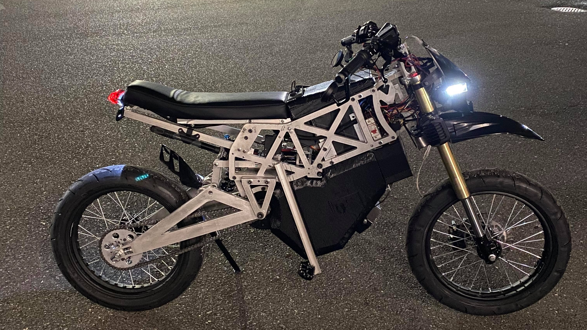
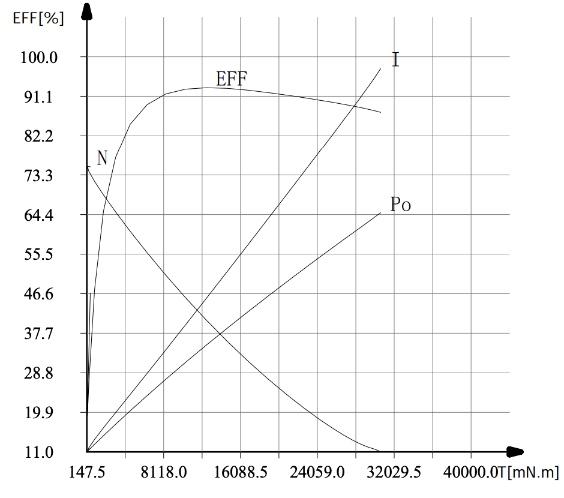
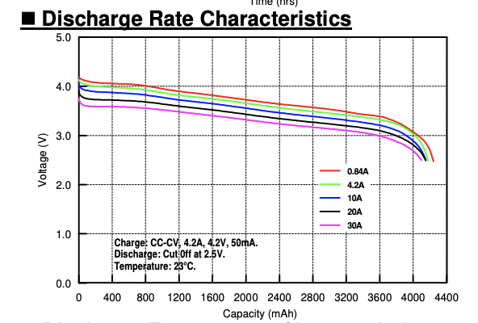
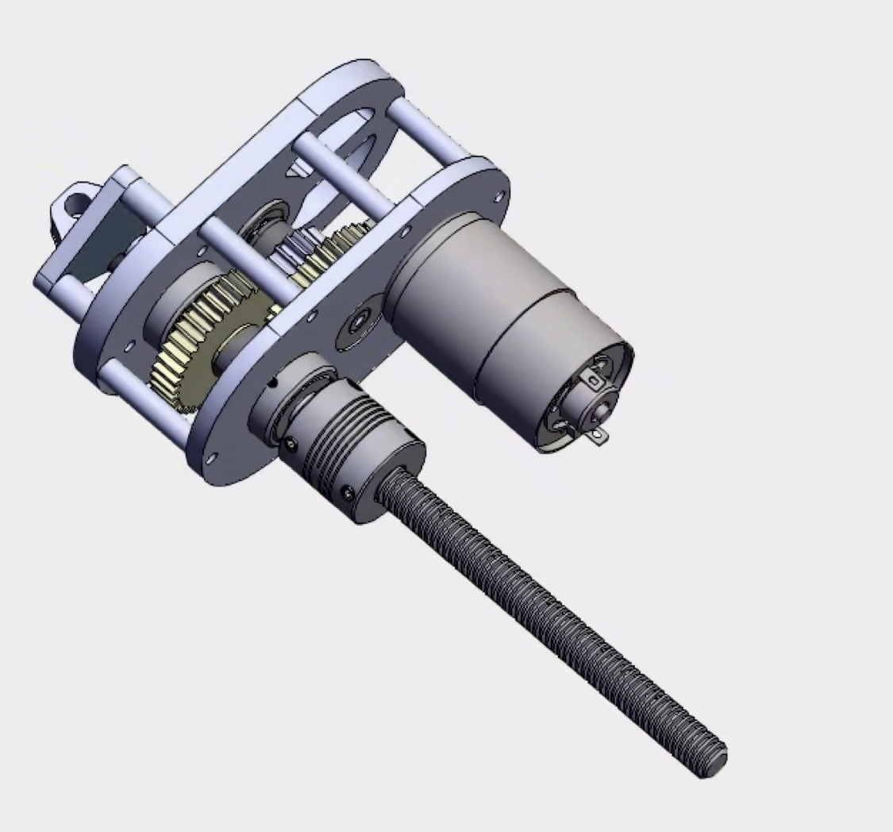

# TLDR;

- Lead Electrical Engineering and Computer Science Team in the development of high voltage and low voltage electrical
systems, software, mobile and desktop application of an IoT enable class 2 electric emoto bike capable of going up to 65mPh
- Built fully functional initial prototype using a decentralized system using STM32 dev boards communicating through CAN
- Designed systems for a remote unlock of bike with smart phone and connectivity to the cloud in order to track various metrics
through use of Raspberry Pi with Comodule board and API’s

# [Photo Album](https://photos.app.goo.gl/cWPPMNzK5nw2ipwP8)

# Introduction

Amped Emotos was a startup I was a founding engineer of. The goal of the company was to create a moto style bike
that was electric for both consumer and fleet vehivle applications. The company was started the summer of my sophomore year at 
UC erkeley, and was made up of a group of 10. There were 4 engineers (3 mechanical engineers and myself), 5 business people, 
and the CEO. The engineering team started completely from scratch and in 3 months was able to build a fully functioning 
prototype motorbike capable of 60 mph! We named the prototype Katara.

My role on the team was Chief Electrical Engineer and Computer Scientist - which meant I led the development of everything 
that had power going through it. I was the only EE or CS person on the team, so getting a fully functioning prototype working 
in 3 months was definetly a huge personal challenge and accomplishment. 

In this project post, I'm going to breakdown Katara's architecture and go into detail on the subsystems I lead the development of.

# Problem Statement: Build a protoype quickly & for cheap

The problem statement for the summer was to build a moto style bike that was capable of going 100 miles at an average speed of 45mph and
a max speed of 75mph. The bike would need to handle a wide variety of terrains, sutable for use both on and off roads. We had around $22,000
to spend on parts and manufacturing of the system, so our budget was pretty tight. With the goal of selling B2B, the bike needed to have fleet
vehicle features, such as remote control and telemetry.

Overall the prototype needed to be small, but also extremeley powerful. The reason for this was to be able to adapt to different customer needs when 
demoing and not restrict ourselve to a single market. 

# Katara's Architecture

I joined this project with 2 years of experience on Formula Electric at Berkeley, because of that I tried to mimic that system 
as much as possible.

Katara was designed to be a distributed system with the cabality of simple expansion. This was acomplished by the use of CAN being
the main form of communication between nodes of the vehicle. CAN allows for an easy addition of nodes to a distributed system, and this
was essential for us. As the intention was to build baseline funcationlity first then gradually add more sensors and features as we went.

That being said there were a few main nodes of the system: Electronic Control Unit (ECU), Battery Management System (BMS), Motor Controller, 
and Data Control Unit (DCU). The system had a 6 kWh battery, with a motor capable of putting a maximum of 12 kW of power into the ground. 

In the development of the initial prototype I was bottlnecked by a few things: manufacturing capabilities, small budget, and 
lack of engineering hours. As a result of these constraings, I decided very early on to buy as many things off the shelf
as possible for a first prototype.

# Motor and Motor Controller

We decided to go with a [10 KW BLDC Motor](https://goldenmotor.bike/product/48-volt-10kw-bldc-motor-air-cooled/) and a 
[BAC 8000](https://www.acceleratedsystems.com/products/electric-motor-controllers/bac8000) motor controller. We went with the golden motors 
system because it was the lightest option that met our power needs. The BAC 8000 was chosen because other people on the team who rode 
electric street bikes where familiar with BAC products and how easy they were to work with.

# Battery

Based on the stats the business team gave us, the system needed to go 100 miles at 45 mph on a single charge as well as be capable of speeds up to 70 mph. 
We reverse engineered the battery sizing based on these requirements. We chose to go with 2170 lithium ion cells, as they seemed to have the best energy density 
on the market while also being capable of fast discharge. Once we had the cells chosen we could use their discharge curves along with the motor's power
curves to figure out setup that met our requirements. 

The final pack setup had 360 2170 cells in a 18P and 20S configuration. The pack's nominal voltage was 72V with 84Ah, and a maximum discharge rate of 64.8 kilowatts.
We did not have the man power or time to design a custom BMS and assemble the pack in house, so for these reasons we had a local manufacturer built it for us. For the 
BMS we had to use what the manufacturer offered, so the system ended up using a DALY smart BMS. This BMS had the same problem as most off the shelf BMS's it was really 
large and didn't package very well with our system. Other than that and the fact that it used UART instead of CAN, it was fine. 

In the end this battery was way overkill for the mechanical capability of the bike, but it was in line for what the original vision of the bike was.

# Electronic Control Unit

This is where most of my development time during the summer went, the ECU would be the thing that brought everything together and handle almost all the controls of 
the bike. I really didn't have much experience with microcontroller development before this, after being Chief EECS of FEB I would've made half the mistakes and finished
this part of the system in half the time. Looking back I realized I was asking myself the wrong questions half the time, but hey that's life.

INSERT FUNNY DEBUG PICTURE

This node of the bike would: process all sensor input, control the motor controller, control the ILAS system, and log all CAN messaged. The microcontoller we chose to
use was initially an Arduino MKR Zero, but it was intended for more of hobbyist use and didn't give much control. In the end we switched to the STM32F446RE. The board's 
main function was to communicate throttle commands to the motor controller. It would take potentiometer readings from the driver's throttle, then translate them to torque 
commands that were sent to the motor. In addition to this it logged all sensor data from the bike to an SD card. The sensors that was on the bike were the BMS voltage 
and temperature monitors, an IMU, wheel speed sensors, and throttle input. In addition to sensor processing, the ECU was used to control the lights and other peripheral's 
of the vehicle. We chose to do this programatically instead of having the used turn on and off switches in line with the power so later on we could add features so a user
could remotely use the peripherals.

# ILAS: Intelligent Load Adjustment System

The ILAS system was an idea the team had to dynamically adjust the ride height of the vehicle on the fly. The benefit of this is that different applications
benefit from a bike riding at different heights. For example if you're going off roading, or delvering goods you'd want to be higher off the ground to have 
more clearance. However, if a user is trying to go fast they would benefit from being closer to the ground. 

The way we implemented this was by having a lead screw that would adjust the mounting position of the suspension. The system was designed so the lead screw 
didn't take any load, so there were no reliability issues. The lead screw was powered with a [775 Pro](https://motors.vex.com/vexpro-motors/775pro#sljv8tn) motor 
and a [Talon SRX motor controller](https://www.vexrobotics.com/217-8080.html). The ECU would send PWM signals to the Talon to control it. We had future plans 
to have the system continuously adjust during a ride, but didn't have enough time to implement this.

# Telemetry

One of the big selling points of our system would that it would be great as a fleet vehicle. The "fleet vehicle" features we wanted to implement as a part
of our first prototype were: remote vehice control, GPS tracking, and data telemetry to "base station". We did not have the resources to build an in house
solution for this, so we decided to [CoModule telemetry system](https://www.comodule.com/). This was a simple way to bring IoT capability to our product while 
keeping our dev time and cost low. The CoModule system is really simple to work with, as they have ready to use API's that were easy to integrate. 

# Conclusion

Although my only focus was on the engineering side of this project, this project definetly taught me how important the 
business side of a company is. That summer we built an amazing prototype that was perfect as a first step towards a real product.
However you can build a great product, but if the market doesn't need/want that product you end up just wasting your time. Sadly, in the
end Amped Emotos failed because the e bike market was so saturated, and not enough market research was done to confirm the niche
we were creating for actually existed. In the end, it was a great experience and I'm so happy to have been apart of such a fun and
motivated team! 

Shoutout to my fellow engineers Tijmen Sep, Gavin May, and Themis Hadjioannou :)
