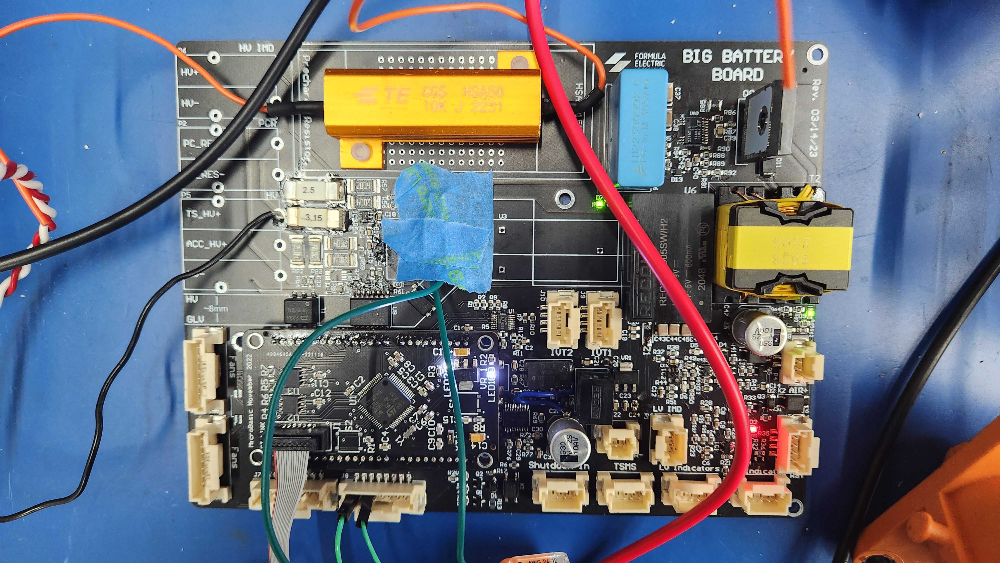

# TLDR;

- As Chief EECS Engineer I oversaw/managed the design, implementation, and manufacturing of electric and software systems of a
  Formula SAE EV race car
- As Chief EECS Engineer I oversaw/managed the design, implementation, and manufacturing of electric and software systems of a
  Formula SAE EV race car
- Manage a team of 35 designing more than 20 custom PCBs and custom firmware to create an electric race car with an 80kW
  powertrain, active telemetry system, and pit interface capable of going 80 mph while carrying a human safely
- Optimize performance of system to inverter efficiently supply maximum amount of power without overheating battery of car
- Project lead of low voltage power distribution board and ground station software/interface in previous years
- Designed all hardware and firmware from scratch for a PCB switching between two power inputs supplying power to low
  voltage systems, tracks power draw data of systems, and communicates through CAN using a STM32F446 microcontroller
- Joined team as a founding member with

# [Photo Album](https://photos.app.goo.gl/55bmf2f8Vo1RnfF58)

# Introduction

[Formula Electric at Berkeley](https://ev.berkeley.edu/) is club at the University of California: Berkeley. The club has
roughly 80 members, and serves to educate it's members with real world engineering skills through building a car to
compete in the [SAE Formula EV competition](https://www.fsaeonline.com/). Every year the car is designed to be able to
carry a 5th percentile female to 95th percentile male and participate in a series of races: acceleration, endurance, and
autocross.

Fun fact the [fastest 0 to 60mph acceleration recorded by an electric car](https://www.npr.org/2022/10/14/1128923148/german-students-break-the-world-record-for-fastest-accelerating-electric-car-aga#:~:text=be%20long%20gone.-,The%20electric%20racing%20car%2C%20built%20by%2020%20University%20of%20Stuttgart,hour%20in%20just%201.461%20seconds.)
was set by FSAE competitor Green Team.

{/* 

  <iframe
    width="420"
    height="315"
    src="https://www.youtube.com/watch?v=xjDK0LhKkMs"
  ></iframe>

 */}

Formula Electric at Berkeley (FEB) was created in the Spring of 2020 from the remnants of the Berkeley Hyperloop Team. I
joined the team as a freshman the semester it was created. My freshman and sophomore year I developed the car's shutdown
circuit and my junior year I was HV PM. My senior year, I became EECS lead, responsible for managing 35 EECS students directly while simultaneously
working with the ME lead to organize the full 90 person team. I worked with sponsors to attain funding, create timelines,
review all EECS designs, and decide overall car design.

**In my year serving as Chief EECS Engineer FEB developed it's second car (SN2), the first one to drive and be fully
fuctioning. I will focus on that car in this post.**

Disclaimer!! A lot of the components broken down below I did not personally design, but gave guidance, reviewed, and made sure
worked properly as a full system. I will do my best to give credit to goons that led these projects as they come up!

# Problem Statement: FSAE EV

Since 1981, each year Formula SAE releases a new 150 page rule book for the same general competition. The competition revolves around teams building a
formula style racing car to compete in a series of dynamic events: 1/4 mile acceleration, skipad, autocross, brake test,
efficiency, and endurance. In addition, to dynamic events the competition consists of static events: design and business events. These
secondary events serve to ensure cars are created with proper engineering and business first principles, in a reproducable
manner like a car OEM.

# SN2 Architecture

SN2 was designed with the goal to be rule complaint, manufacturable, safe, and to finish an endurance race. It had a 571.2V
battery pack with a maximum power output of 80kW - approximately 110 horsepower. SN2 ran a single Emrax 228 motor with a
rhinehart PM100DZ inverter. The car had a decentralized computing system, where nodes - moslty made of custom PCB's architected
around the STM32F446 microcontrollers - communicated with eachother over a CAN bus. SN2 had an interactive driver heads up display,
datalogging, and a telemetry system that fed data to a pit GUI. This allowed us to make data driven decisions in order
to improve SN2 and prepare for SN3.

# Accumulator (AKA High Voltage Battery)

The accumulators is the heart of the car, without SN2 would be a glorified shopping cart. That being said it was also the most
difficult part of the car on the EECS side to prototype, design, and build. Building a functional accumulator is a true test of
safety and good engineering practices, 9/10 times it's where FSAE teams fail.

SN2's accumulator was broken up into two piece: the attic and segments housing. The segments housing was where the actual battery
cells were, and the attic was where all of the safeguards and logic of the acculumator was.

## The Segments Housing

## The Cells

SN2's accumulator was a 571.2V battery pack capable of 80kW of discharge. The pack was comprised of
[energus modules](https://drive.google.com/file/d/13J72bW00z5FcrS1s2J84LHX0J47q02Jx/view?usp=sharing) made from Samsung 18650 cells.
The modules were made of 4 18650 cells put in parallel, each module had 10Ah and 3.8 nominal voltage. The great part about these modules
interfaced with bus bars with built in skrew threads, requiring no spot welding. In addition to this they had built in temperature
sensors that were simple to connect with using a molex connection. The only problem with these modules were that they were very difficult
to package: you can't take advantage of how cylindrical cells can lock together resulting in an overal larger battery size.
The reason we chose these modules are because they did not require any spot welding, and the temperature sensors were built in.

## Segments

The accumulator had a few levels of "battery abstraction". The lowest level was called the "cell" this was the actual cylindrical Samsung
18650 batteries, the next was the "module" which were the energus modules that put 4 of those 18650's in parallel allowing for 10Ah of discharge.
The modules were still low voltage, we would put 17 of them in series in order to build up to a nominal voltage of 64.6V. We would call this
HV set of modules a "segment". Finally we would put 8 segments in series to create the final "accumulator". The reason we split up the accumulator
like this is due to safety. HV is dangerous, so by splitting the pack up, if something goes wrong the amount of energy that you're dealing with is smaller.

The segment was comprised of the energus modules, Batter Management System Daughter and Aux boards (I will cover this later), bus bars, and caps. They
were designed in order to be easy to assemble, safe, and extremely compact. I would say they they were safe and extremely compact. The way
this was accomplished was by realizing that the insulation that was already installed on the modules satisfied FSAE's rules requirements so we did not
need to add any additional material on the sides, all we needed were caps to protect the bus bars and BMS boards that were stacked on top of the modules.
In between the modules and the packs was the BMS daughterboard and aux boards which was great for packaging

I thought this was a great idea initially, however it was in the end very difficult to assemble the segment requiring one to readjust a segment being
aseembled constantly in order to get a different angle to install a bus bar, temp sensor, etc. An adverse affect of this was that if any stress was
put on the green insulation of the modules they would tear, and moving the segments around so much during assembly would cause this to happen quiet often.

In addition to the difficultly of assembly, these caps made it essentially impossible to debug the BMS boards on the segments once the caps were installed.
They completely covered the system and didn't allow for any probing to be done and all the indicator LEDs were covered. So anytime a problem was found the
entire segment needed to be disassembled.

My final note about the segments is that working with them truly allowed me to appreciate the dangers of HV. It is not something to be played with and
should be respected for its ability to do real permanent damage to a person. As a result I made this HV safety tutorial that I thought would be good to
make open source. Below is a result of a close call we had when dealing with segment testing. NEVER RUSH and ALWAYS have an exact plan when dealing with
HV systems.

## Intersegment Connections

One of the great mechanical advances that was made in SN2's battery pack was the intersegment connection. In the previous year we used
[radlock connectors](https://www.amphenol-industrial.de/en/Radlok-Connectors), which I love for prototyping and testing idea. However for real use in
an FSAE vehicle, they package very poorly and require a lot of force to remove which causes problems when working with them in a small battery pack.

This was due to the fact they took fully insulated wiring as an input - insulation adds a lot of volume compared to a bare bus bar or wire, and you cannot
do 90 deg or shart turns with wire.

For we used bus bars with moles pins on the ends of them in order to do intersegment connections. Bus bars are great for packaging because you make their
internal surface area whatever you want to meet your packaging needs, and they can be made to go in different angles very easily. It is all up to your
imagination and machining capability.

The way the bus bar interfaced with the segments was simply with a molex pin and socket that was spec'd for high current and voltage applications. There was
no locking on the pin which allowed for easy installation and removal. However it is important to have some sort of "positive locking" in the system so vibrations
of the car don't cause the bus bars to come out and cause issues. The way we achieved this "positive locking" was the lid of the pack went directly onto the bus bars
and pressed down on them so there was no way that they could get jostled out. The bus bars had properly spec'd heat shrink everywhere but the pin connection and
the pack lid had a thick layer of insulating foam, so there was no chance of the metal lid shorting the system.

## BBB: Big Battery Board

The Big Battery Board AKA the BBB was the brain of SN2's accumulator. It was responsible for handling all information pertaining to the accumulator, sending
pertinant info to the rest of the car, making sure the battery was in a safe condition, and shutting of the system if it wasn't.

This board was made out of a hatred for harnessing born from working on SN1's pack. Inside SN1's attic there was 5 custom PCBS's: BMS Mother Board, HV Indicator
Light Driver, IMD Driver, Precharge Circuit, HV Fusing. After realizing that each board had almost the same inputs and outputs, we decided to consolidate
them all into a single board called the BBB, which reduced the time and complexity of harnessing exponentially! The following picture shows SN1's attic on the left 
vs SN2's attic on the right, displaying how much smaller SN2's is.

A huge additional benefit of integrating all these boards on a single system with a microcontroller is that if one fails we can both have an indicator light
and send a failure message over CAN to indicate where the shutdown cicuit was initiated from. Shoutout Nikhil Ograin for making this thing so well!

## BBB: BMS

The BMS had a 3 level architecture: mother board, daughter board, and aux board. All together they collected data to confirm the battery was safe, and shutdown 
the car if it wasn't.

## BMS Mother Board

The mother board was the orchestrator of the system. It would control all the daughter boards, communicate the state of the battery to the rest of the car,
ensure the battery stays in an acceptable voltage range and temperature, and shutdown the system if it was in a dangerous state. All things considered the
motherboard was essentially a microcontroller with the correct break out to read and control outside components. It would take in the isoSPI signal from the
cells convert it to CAN and communicate the info to the rest of the car. In addition if anything was unsafe it was a part of the shutdown loop and would
begin shutdown if needed.

## BMS Daughter Board

The daughter boards design was centered around the LTC6811-1, it was a great solution for our needs. The chip is is capable of measuring cell voltage, enable cell discharge,
GPIO, ADC, and isolated communication for 5-12 battery cells. The reason we used two of these chips on each aux board is because they were only capable of up to managing 12
cells and we had 17 modules in each segment. They interfaced with the aux board through a pin connection like an arduino shield.

Once we had this IC we just need to figure out a way to give it power, and how to get them to work with our temp
sensors. For the most part we followed the recommended exmample given in it's data sheet. To power the chip we used an LT3990 buck converter that dropped down HV
from the segments to 5V, again not really changing much from the schematic. The LTC6811-1 only had 5 GPIO pins and only two of them were 2 ADC pins. So we would not be able to feed in all the temp sensor
data directly into it. To tackle this we used two 1:8 MUX that would take each read the same temperature signals and send them to both ADC pins. We controlled the mux
with the remaining 3 GPIO pins 2^3 = 8, so you command 8 different signals.

Additionally this setup required minimal harnessing, because iso-SPI allowed all the daughter boards to be daisy chained together.

## BMS Auxillary Board

The Auxillary boards served to essnetially gather all the signals needed by the daughter boards, and also hold the cell balancing transistors and resistors. For each
module the segment had 4 components that were repeated across the board: temp sensor driver, fusing, RC filter on voltage, and balancing circuit. The ladder were combinded into
a single circuit block in design.

The temperature signal outputted by the energus module was from a temperature sensitive diode. So we needed to provide a voltage and then measure
the forward voltage of the diode, here we do that with the 5V and 680V resistor. From there we just have an RC filter to have a stable output as it'll
go directly to the daughter board.

The cell balancing sub circuit has an input fuse that will protect the rest of the system if the module shorts. The RC filter on the voltage ensures a stable
signal as this gets fed straight into the daughterboard. Then there's the actual balancing circuit, which is just a P-MOS that acts as a switch connected to
a resistor. Whenever you need to bleed voltage of a module the daughter board will control this to close the loop of the module with the resistor. The LED is just
there as an indicator for when we're doing balancing.

## BBB: E meter
In order to measure the full HV voltage and current on the system we were presented with two options. Build systems that could do these functions, or get an off the 
shelf solution. We found the [IVT S-Series Current Sensor](https://www.isabellenhuetteusa.com/product/ivt-s-series/). It was a solution that perfectly fit our use case 
and would save us many engineering hours, so we opted to use it over a fully custom solution. It worked great, it had a high current measurement sensor and 2 HV capable 
voltage sensors and would automatically send it's measurements over CAN. All it needed from the BBB was power. The BMS would use this sensore to inform battery safety and
since the sensor was built so well we never had any issues and could truly trust the battery was safe.

{/* ### BBB: HV LIGHT

Per FSAE rules  */}

### BBB: Isolation Monitoring Device (IMD) Driver
FSAE (very wisely) also required all teams to include all teams to have an isolation monitoring device in their battery that would test for isolation between HV ground and 
LV ground in the car. For safety reasons and per the rules they were required to be isolated. FSAE didn't trust teams to spec or design a sensor to test for this isolation,
they just made all teams use the [Bender ISOMETER® IR155-3203/IR155-3204](https://www.bender.de/fileadmin/content/Products/d/e/IR155-32xx-V004_D00115_D_XXEN.pdf). Looking back
on it, the sensor was pretty neat. Doing everything analogue, it would create pulses of 150V potential difference between LV and HV ground. Then it would measure voltage difference
between the two during the pulses and confirm they looked alright. Based on this the sensors sends out a binary yes/no on if there are no isolation faults. The yes/no signal is
sent as a voltage of Vdd-2 for yes and 0V for no. We drop this down to 3.3 volts and compare it to a hard coded 1.5V to check if there's any isolation faults. If there are faults
we open the shutdown circuit. In addition we have an SR latch in the system to make sure that the shutdown circuit can't be closed again until it's reset. This is for safety, as
there is a scenario were you can have isolation faults intermittently, but you want to shut down the system immediately after the first one for good.

{/* ### BBB: HV -> LV Power Converter */}

## Accumulator Isolation Relays: AIRs
These are pretty much just big switches. These go in between the output of the battery and the rest of the car, one on HV + and one on HV -. When the car is ready to drive after 
all the safety checks happen these switches close and power can flow out of the battery to the rest of the car. The whole point of the shutdown circuit is to open these switches
when something goes wrong in the car. The AIR's are simple but important.

## Fan and Fan Drivers
Sadly cooling was an after thought on SN2. We had no simulations to back up any claims we had. But, we knew that adding fans could only help our system be more efficient (for the most part).
Following this trian of thought we slapped 12 [Sanyo Denki 9WPA0624P4G001](https://www.digikey.com/en/products/detail/sanyo-denki-america-inc/9WPA0624P4G001/13170607) fans on the thing and
called it a day. We split them up into 4 groups of 3, each group was controlled individually using 4 125kHz PWM signals. Each fan also had a tachnometer, which would return a signal
that showed how fast the fan was actually spinning, we used this to create a closed loop system to get fans to go the exact speed we wanted them to. 

In the end, right before competition we removed the fans from the accumulator and sealed all the holes due to concerns over water proofing. So this system was never tested beyond the bench.

# Electrical Engineering

The Electrical Engineering team handled all EE tasks of the car outside of the accumulator. From a program management stand point this split helped with team managemment significantly. If the
accumulator of the car it's heart, the EE team was in charge of delevoping the car's nervous system and motor function. It designed the systems to take in all the sensory input of the car, 
analyze it, and then either: store, display, or use that induce/adjust movement from the car. This subteam worked closely with the CS subteam in integration hell, getting all the sub systems to
work together like an orchestra.

## Shutdown Circuit

The shutdown circuit is the car's main safety system, and is the most strutinized part of the car during inspection. The easiest way to explain the shutdown circuit is to work
backwards. The last part of the shutdown circuit is the AIR's that were talked about above, the entire purpose of the circuit is to do a series of safety checks before closing 
the AIRs and as the car operates open the AIRs if the car gets into a failure state. The way that this is accomplished is by having the shutdown circuit be the AIR's coil power
path. So every node of the car that is part of the shutdown path can be thought of as a switch that is inline with the coil power path of the AIR's. Now if those nodes are 
operating in a favorable state they will close their switch, and if all the nodes close their switch the AIR's will close and the car can be operated. However, once a single 
node reaches an infavorable state it's switch will open, the AIR's coil will no longer recieve power, the AIR will open, the car will shutdown, and the car will no longer be able
to drive. That being said all the LV functions of the car will still operate as normal, because the shutdown circuit only opens the AIR's when shutdown happens. This system is 
pretty intuitive when you grasp the concept, but alwasy difficult to teach people in my opinion as they ofetn get stuck on small details.

So moving foward if any board is part of the shutdown loop, that simply means it has a relay that will open when it reaches a failure state. 

## Common Circuit Blocks

Between PCB's there is a significant amount of overlap, for example power input, CAN communication, use of a micro controller, etc. So it makes sense to create these
elements in a vacuum so they can be copy and pasted into all designs with ease. This has a huge number of benefits: reduction of overal design time, easier debug time, 
more consistency, and allows designers to focus on board functionality instead of small details. Additionally it allows for a smaller barrier of entry for younger members 
as the foundation of their board is now already designed.

## Common Circuit Blocks: MicroBasic

The microbasic common circuit block allows a designer to simply add microcontroller functionality and CAN communication to their board. The circuit is designed to 
be have an arduino like shield interface. So all microbasics have the same form factor and can be swapped between boards.

The microbasic circuit block was designed around the STM32F446RE  microcontroller, so it had a wide range of functionality. It has a single core that can clock up to 180Mhz, 
128kB of RAM, and 512kB of flash. It has a variety of IO which is important for our use cases: 2 CAN (Controller Area Network )bus, 3 SPI (Serial Peripheral Interface) bus
4 I2C bus, 2 UART (Universal asynchronous receiver-transmitter), 4 USART (Universal Synchronous/Asynchronous Receiver/Transmitter), 3 Analog to Digital Converter (ADC) 
with 14 multiplexed channels, and almost any pin can be used as GPIO (General Purpose Input and Output). By default the STM32 It has an internal clock of 16MHz with 1% accuracy 
(which is not very accurate), so we uses external [CSTNE8M00G550000R0](https://www.digikey.com/en/products/detail/murata-electronics/CSTNE8M00G550000R0/8747739) crystal 
oscillator to provide better clock signal for the MCU. In order to flash code to the STM we use and an [STLink-V3 Mini](https://www.notion.so/SN1-MicroBasic-1deca4169f56468c99fa2c085f99298a?pvs=4#ab11aacb53344ac3afc457d902257981)
that would flash the board through SWD (Serial Wire Debug).

The microbasic has 2 built in CAN transcievers, allowing a designer to leverage the 2 can buses available on the STM32.

The board gets 5V of power from pin 2 which is dropped down to 3.3V for the STM and CAN transcievers

The microbasic was a great board design, it was reliable and simple to use. I think our ability count on this design really allowed the EECS team to built reliable
LV systems. 

## LVPDB: Low Voltage Power Distribution Board

The LVPDB was actually the first thing I ever worked on in FEB, so it has a special place in my heart. One could say it's the most important board of the whole 
car, as without it none of the other boards could function lol. 

The LVPDB was designed to be able to safely deliver LV power to all parts of the car while tracking the amount of power going through the system. The board took 
a 24V power input from 2 12V drill batteries wired in series. We used drill batteries, because they are already water proofed so we didn't need worry about designing
our own. The power from the input is then delivered to 3 24V branches and 1 12V branch, each of which is fused for protection and the 24V branches have a TPS2482 hotswap 
controller in line. The reason there is a 12V branch is due to grandfathered systems fro SN1 we didn't want to change. 

The way that we were able to ensure the fact that each branch had power being delivered safey was through a fuse initially. Then for all 24V branches the TPS2482 
provide an extra layer of protection. The TPS2482 chip was a hotswap controller, usually used in computer towers so you can safely remove graphics cards. These
chips provided overcurrent protection, power good, switching ability, as well as monitor voltage, current, and power drawn by each of the branches. The chips were
connected to a microbasic, so all of this information was sent over CAN and stored by the data logging board. These chips were really great, as they provided protection
while providing digitalized sensor readings that the microbasic could read.

## LV Harnessing

The goal for LV harnessing was standardization and reliability. We wanted to minimize the number of wire runs in addition to unique connectors, crimps, and wires in
the car. Accomplishing these 4 goals would make simplify manufacturing and servicing SN2 extensively. The standard components we chose were CAT5 cable with RJ45 connectors, 
binder cables with binder connectors, and duraclick connectors for PCB's. 

The way we decided to reduce the number of wire runs was to daisy chain all the PCB's with a single run of CAT5 cable running through the entire car. We were able to do
this, by having an input and output ethernet port on each node of the car that was shorted together. CAT5 is a shielded cable with 8 wire strands made up from 4 sets of 
twisted pairs. We used the CAT5 cable to route power and CAN messages to each board on the car, 2 of the pairs were for power and the other 2 were each inidvidual CAN buses. 
We chose CAT5 because of it having so many individual strands in a single cable, a reliable industry standard, and it being easy to work with. The only out of the orginary
thing we did with the CAT5 cable was deliver power over it. It is spec'd for 2.2A of consistent power, but we knew we'd probably be pushing a bit more than that. So to make 
sure this was okay we set up a test rig that pushed 5A of power through the cable for a few hours and nothing happened. After that we decided it should be good to go. The CAT5
cable didn't have any downsides in my opinion, I thought it was a great solution for our use case and really simplified wiring.

For sensor inputs on boards and anything that wasn't CAN or power we used binder connectors and cables. These cables were grandfathered in from SN1 and were chose because of
their water proofing. They were the cable we used for our shutdown circuit wiring and any general use case. To be honest they were very difficult to woby rk with, the wires were 
held in place by skrew terminals and were easy to fall out, to connect a male and female binder you'd need to twist them together and this would often cause the cable to twist too
and break things, and worst of all they were really expensive to be having all these problems. Overall I wish we'd chosed a differen't general purpose wire and connector system, and
I believe they're doing so for SN3. 

## APPS: Accelerator Pedal Position Sensor

The APPS is exactly what it sounds like. It's a sensor that read's the position of the accelerator pedal of the car, confirm the sensor reading is plausible, 
then commands the motor controller to get the motor to spin. In addition to accelerator pedal positional readings the APPS collects front and rear brake pressure 
transducer data. 

We used a micro basic board in order to take in the sensor data, and then handle the plausibility checks of the sensors. If they seemed implausible we would disassemble
the ability to command torque from the motor. In order to send torque commands to the motor controller, the micro controller would send CAN commands. 

An additional feature that wasn't added before competition was to dynamically create torque commanding curves based on the state of the car. The motivation for this
is that you want the car to be able to self regulate as the battery gets hotter and begins to behave in non-optimal ways. By rules no part of the car can reach a
temperature of greater than 60C, so if your battery is at 55C and you continue to run the car at its maximum speed it'll hit 60C and now you'll have to
wait for the battery to cool down. Instead of doing this, you should adaptively generate torque mappings reducing and increasing the maximum amount of torque
the accelerator pedal can command based on different factors of the car. This will keep the car operating in an optimal state for longer. 

{/* INSERT PICTURE OF DYNAMIC TORQUE MAPPING curves */}

The way this would work would be fairly simple. The ECU already collects all the data from the car so that node would take that data and generate the
function, and then send it to the APPS over can. The APPS would then use that function to send optimal torque commands to the motor controller. This 
system is very doable in the future, but during SN2's development we had limited battery data so we couldn't create proper torque curves.

## BSPD: Brake System Plausibility Device

The BSPD's purpose is to shutdown the car if the brake pedal is being pressed and there's power being sent to the car's inverter. This system is required, by the
FSAE rule book for safety reasons. In addition it's fully analogue, which is also required by the rules. This system is split into two parts, because the brake 
pedals are in the front of the car and the inverter is in the back of the car. The part in the footbox near the brake pedal handles the brake pedal input and
 shutdown logic, and the part in the back of the car measures the power being delivered to the inverter. The system will shutdown the car if there is a short 
in any of the BSPD's sensor inputs or if the brake pedal is being pressed while high power is beingdelivered to the inverter. 

## Pre-charge and Discharge

The purpose of the pre-charge and discharge circuit was for pure safety. The reason they're needed is due to the large capacitors in the motor controller.
Once the car is ready to drive the motor controller gets connected to the battery, and once that happens the capacitors in the motor controller will
charge to the same voltage as the battery pack. 

The way the precharge system works is that once the car is ready to drive, before you close the main AIRs you on the + side you close a different line
with a large resistance on it. 

What this does is that it reduces the amount of current capable of going through the system, making it so the capacitor in the motor controller slowly
reaches the same voltage as the battery pack. Then using the IVT current and voltage sensor we can measure the capacitor voltage of the motor controller
and close the main + AIR once it reaches 90% of the main pack voltage. 

The reason the precharge is there is due to INSERT MATH I DON'T WANNA DO IT ON THE PLANE, once you connect the battery and motor controller there will
be a large in rush of current going to the motor controller. This is really bad, as this large current surge could potentially fuse the contactors in
the AIR's we talked about above. The whole point of the AIRs are that they're supposed to open when the car's unsafe, but if they're welded together
due this can't happen. In addition the inrush of current can also generate enough EMI to break other commponents in or around the motor controller. 

The way the discharge works is essentially the same way the precharge system works. Once we turn the car off, we connect the + side of the motor controller'S
power input to a resistor that's connected to ground. What this does is it drains all the excess voltage from the motor controller capacitor and bleeds it 
through the resistor till it reaches 0V.

Now the reason for the discharge circuit is that if we were to leave the motor controller without discharging it if someone were to touch it's + and -
inputs they would be shocked with HV. This would be really bad, and potentially fatal. So we drain all that energy through a resistor so there's no safety
concern and you can handle the motor controller with ease of mind.

## Steering Wheel

The steering wheel - apart from the pedals - was the driver's only interface with SN2. On SN1 the steering wheel housed an entire rasberry pi and had 
a built in screen. This was extremeley difficult to package and not reliabe. So for SN2 we opted to just have a series of knobs and buttons on the 
steering wheel that would send commands over CAN to various parts of the car. We could map the buttons to anything we wanted, so it was very 
versatille. I really liked how we opted for reliability and function over form here, I think it really helped us down the line. 

## ECU

The ECU was designed to be the central data node of the car. The ECU served multiple purposes: data logging, data telemetry, driver data display, and generation
of the APPS's torque curve. The reason that all of these functions were combined on one board is because each of them requires the same data from the car. 
If this functionality was split between many boards it would flood our CAN bus with too many messages, so why not just combine it all into one board. The ECU 
was a combination of a [Rasberry Pi 4](https://www.raspberrypi.com/products/raspberry-pi-4-model-b/), an STM32F446RE Nucleo board, an
[Xbee radio transcievers](https://learn.adafruit.com/xbee-radios/overview), and a display. 

The way that system processed information was that the STM32 essentially was just there to translate CAN data to SPI and send it to the Pi to process. This board 
needed to do a lot of things, so we leveraged its extra compute power to handle all these tasks. The thing other than CAN -> SPI translation the STM would do would 
be using the information about the car from CAN to generate the APPS's torque curve. The Pi will do a few things once it gets the data: write all of it to .csv on the usb 
inserted to it, send pertinant info to the Xbee seen by the pit interface, and also send pertinant information to the driver display over hdmi. 

The main problem with this system was that we did not get an MVP working with just dev boards before we designed the PCB, so the PCB never worked and we ended up having
to use a Rasperry Pi, nuclueo, and xbee boards ziptied together. This wasn't horrible, but was a waste of dev hours creating the PCB that ended up not working. The idea 
of the board was really good though, because datalogging is what allows a team to take large leap by being able to make informed decisions based on the past.

# Powertrain

## Inverter

The inverter that we used was the Cascadia Motions Rinehart PM100DC Motor Controller. This motor controller was grandfathered in from SN1, but it was chosen
for that car because it was commonly used throughout the competition. The motor controller was pretty difficult to get set up, but it was all laid out in the
owner's manual of the system. 

## Motor

The motor that we used was the Emrax 228. Similiar to the inverter it was grandfathered into the system based on SN1. It was very common throughout the FSAE EV 
comunity so we chose it because of that reason. The motor worked great with the inverter, and like the inverter all its setup instructions were laid out in its
owner manual.

## Cooling

The inverter and the motor were the only water cooled parts of the car. The setup was quite straight forward in theory, we had a radiator on the side of the car
and a pump that would circuilate the water through it and keep it cool. The pump that we used was the [UAkron GRI INTG7 060](https://www.gripumps.com/pumps/intg7/).

{/* # Computer Science

I don't feel like it's necessary to go into the specifics of the CS implementationf for each part of the car as it'll get boring quite fast. However, I think 
it's important to go over our overall code diagram, that broke down where different parts of the codebase would be running on the car.

## SN2 State Machine */}

# Appreciation!

Tied with the ML research I did, the work I did on Formula Electric at Berkeley was by far what I am most proud of. It was anything but easy at times,
but working with such a smart, kind, and driven group made it worth it.

Shoutout to the rest of the FEB 2022-2023 team who all had an equal part in making this car possible!
EECS: Teddy Zhang, Rod Bayliss, Nikhil Ograin, Andrew Mussell, Pranav Pomalapally, Aman Doshi, Evan Sandoval
Mech E: Chris Leafstrand, Weston White, Toshko Andreev, Ming Chin, Simon Huang, and Daniel Pack
Business: Michael McCulloch and Sarah Cheng

