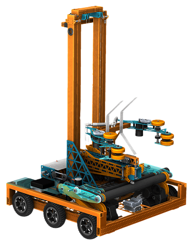
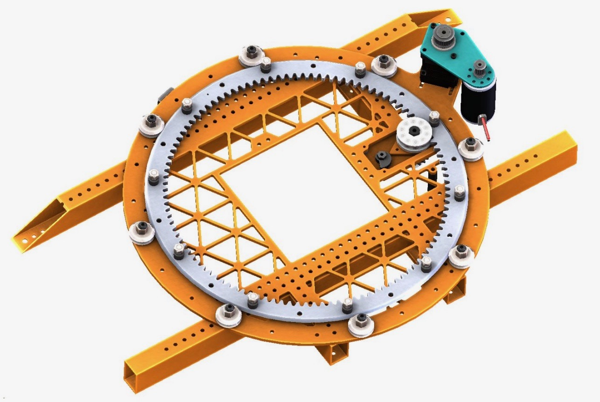

# TLDR;

- Led team of 32 students to design and build a reliable 150lb robot that would compete on a high level, that featured a
  turreted elevator lift system, box collection system, prismatic arm, dual floor intakes, and four bar climb mechanism
- Team ranked in the top 1% of 5,000 teams globally, and has won 4 World Championship divisional competitions
- Used Solidworks to design major mechanical components, fabricated using CNC routers & Mills, and waterjet machines
- Worked and led team on integrating various designs into the final top level of the 150 lb robot
- Interviewed at the world championships spotlighting our robot: https://bit.ly/2OOFpji

# Introduction

[FRC Team 3476: Code Orange](https://www.teamcodeorange.com/robots.php), is a high school
robotics team based out of Irvine, California. Code Orange participates the [FIRST Robotics Competition](https://www.firstinspires.org/robotics/frc),
a high school robotics competition where students build 150lbs robots in a 6 week period to compete in a
challenge that changes yearly.

I joined Code Orange in 2016, as a sophomore in high school, and became a member of the pit crew. In my junior year I
became the co-lead of the electronics teams. In my senior year I became co-president of the team, and lead
technical development on the robot. **I will be focusing on my senior year robot in this post: Cloudbreak.**

# Problem Statement: Destination Deep Space

Each year [FIRST](https://www.firstinspires.org/) reveals a new game and give a 6 week design period for teams to
prototype, design, and build an industrial sized robot. Each game requires 2 alliances, comprised of 3 robots each,
to compete against eachother to achieve certain goals, score more points, and ultimately win 2.5 min long
matches.

In 2019 the goal of the game, [Destination: Deep Space](https://firstfrc.blob.core.windows.net/frc2019/Manual/2019FRCGameSeasonManual.pdf),
was to fill two "rockets" with large rubber balls called "fuel". However, the fuel would fall out of the
rockets unless their exit holes are covered with circular polycarbonate "hatch panels". In the final 30
seconds of the match there was an end game task of climbing onto a platform 1.5 feet off the ground.

  <iframe
    width="420"
    height="315"
    src="https://www.youtube.com/watch?v=Mew6G_og-PI"
  ></iframe>

# The Team's Solution

Following a wish, prefer, demand list, our team determined that being able to fill a
rocket on our own was our biggest demand. We knew the best way to achieve this would be
by reducing cycle times of loading and off-loading game pieces as much as possible. In order
to do this we thought of what things are the biggest time consumers during cycles: aligning to load and
off-load game pieces, turning the drive-base, and dropping game pieces. In our mind the ideal cycle path as a
straight line, requiring the driver to simply push the joystick foward then back... Never having to turn the robot.

# The Robot

As a direct result of our goal to minimize cycle time, we decided on a elevator on a turret robot architecture. Our robot
consisted of a drivebase, turretting elevator, prismatic linear actuator, pivoting intake and outtake system, cargo ground intake,
hatch ground intake, folding climbing mechanism stored in a 2 inch vertical package.

  <iframe width="420" height="315" src="https://vimeo.com/325010694"></iframe>

# Drivebase

Cloudbreak had a 29.5 inch by 29.5 inch 6 wheel drive chain driven drivebase. The drivebase was driven by 4 NEOs, on 2 VexPro 3 CIM
Ball Shifter gearboxes with custom third stage and had a maximum speed of 17.55 ft/second. We chose not to have fully cutsom gearboxes
in order to reduce manufacturing time, and due to struggles with custom ones in the previous year. Pneumatic wheels were chosen to easily
drive onto the hab platform.

# ELectronics

As a result of the packaging constraints introduced by a turreting elevator and a climber that stowed in the drivebase, we had to get
really creative with our electronics bellypan. We had electronics above and below it, having almsot zero unused space. It was mounted on
top of the drivebase instead of below, as most belly pans are, in order to make room for the climber. The plate had tapped holes used to secure
electronics with nylon skrews to prevent shorting to the drivebase - a lesson we learned in 2017.

We had reduced the weight of the panel from 3.9lbs to 3lbs compared to the previous year.

# Turret

The turret -with an overall weight of 7.45lbs - was custom designed to have zero backlash using ides of nexen's rack and pinion solution. It consisted of two parts, a mounting plate
and a spinning ring. The base plate held the driving motor, pinion, and v-groove bearing to secure the spinning ring. The spinng ring was 15 inches
in diameter, with a chamfer on each side of its outer edge allowing it to sit in the v-groove bearings, and on it's inner edge it had a gear profile cut by a CNC mill to always have 3 points of contact
with the pinion.

The pinions were driven by a VexPro Bag motor, with a 10.6:1 gear reduction. Each pin in the pinion was freespinning, held in place by
two 4mm ID x 8mm OD x 3mm thick ball bearings. This helped with reducing friction between the pinon and gear with such a tight fit. The
bearing that held the spinning ring were mounted on eccentric cam bushings for tensioning, and the pinions used a standard WCP cam tensioner. In
addition a hall effect sensor was used to home the turret.

All together this created an extremely rigid and zero-backlash system that never broke.

# Elevator

Cloudbreak had a 2 stage continous elevator with 60.8 inches of travel. There were many discussions about whether to have a single stage continuous
system with a large arm on the top (like 118 in 2018, and what eventually 254 would do). However, we decided that a two stage solution with a
punching arm was simpler and introduce less CG problems. We decided to use a continous elevator in the end as it would keep a lower CG - requiring
only the carriage to lift until system needed to reach past the height of the robot. In the moment it was a good decision, but I regret not going
with a cascading system. The spooling required for a continous system created a lot of packaging and tensioning issues, and a cascading system would
forgoe and of those problems.

The full assembly needed to fit onto a plate with a 15 inch diameter
as it was mounted directly onto the spinning plate. This created significant packaging and design difficulty. It used 1/16 inch thick aluminum tubing for the frame and was held in
place by 1/4 inch triangle plates. The system was driven by 2 775 pros with a 15:1 VersaPlanetary, and a 70:40 final stage. The sytem was connected
with 1.2mm Spectra (UHMWPE) rope that rode on custom-machined Delrin (POM) pulleys. The motors spun custom 3D printed ABS spiral spool to
assist rope coiling at the based of the system. A CTRE mag encoder was used to determine positioning of the system.

# Arm

The turret was place in the center of the robot, and as a result the drivebased would hit a wall before anything on the elevator could reach
far enough to interact with game pieces. As a result I developed a cascading prismatic arm that "punched" out in order to pick up and drop off
game pieces. The system was 3" by 3", it had a stowed lenght of 18" and extended length of 30". In order to stabilize the inner tube a custom
3D printed bearing block was made. It was driven by a pneumatic cylinder at a high PSI to create quick movements.

# Intake/Outake

In order to secure and place game pieces our team developed a claw style intake that could hold both cargo and hatches using a single
mechanism. The claw was opened and closed which pneumatic cylinders and driven by 2 775 pros. My favorite part was that the entire thing
was able to pivot side to side and tensioned using surgical tubing. This would allow it to conform to the angles of the rocket even if
the punching arm came out at the wrong angle.

# Ground Cargo Intake

A major part of the game in 2019 was picking up cargo off off the ground. To the right and left of the hab there were 6 cargo each, and teams
would need to be able to pick these up efficiently in order to have a chance at filling the rocket. For most teams this was not too difficult.
However, with our intake being on a pivot, that sat on an elevator, that sat on a turret, it was very high off the groud. This made it a proper challenge
to get the cargo from the floor into our claw system. In order to solve this problem we developed a 2 roller intake system. The main roller was on a
virtual forebar and pneumatically actuated to go in and out of the robot, and was responsible for getting the cargo into our frame perimeter. The
secondary roller was pulled up by strings that were made taught when the system extended, and served to lead the cargo into our claw once it entered
the robot. The system was spring loaded and made of mostly polycarbonate so it was flexible and would conform when hit.

# Ground Hatch Intake

Although it was not needed for the game, and eventually taken off to conserve weight. We developed a ground hatch intake for Cloudbreak that took
great inspiration from 2017's ground gear pick-up designs. Essentially a HDPE floor scraper with sharpened edge would slide under hatches and then
a set of silicone wheels would pull it in and secure it tightly. Then the system would turn up and hand-off the hatches to the claw. The system was
driven and devloped by 2 bag motors, and weight only 5.27lbs.

# Climber

One of the most difficult integration tasks of 2019 was the climber. Looking back I regret doing an underbelly design instead of something like
254's initial through the bellypan pogo stick lifters. When our climber worked, it worked amazing, when it didn't work it was disasterous. The system
was a massive 4 bar, with a 21.25 inch lever arm lifitng around 125lbs, and stowed flat in a 2in vertical package. It was powered by 2 NEO motors
with an overall gear ratio of 460.8:1. It was a beast. It only took 1.6 seconds to climb, and weighted only 16.75lbs.

# Closing Thoughts

I am extremeley proud of the robot that my team was able to produce in 2019, but in hindsight I really wish we had figured out a way to put
two turrets on the system somehow.
